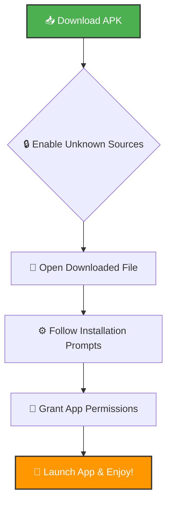

# 🧠✨ Student Mental Wellness & Peer Support

<div align="center">


*A comprehensive mental wellness platform designed specifically for students, combining AI-powered insights, peer support, and mindfulness practices in a beautiful, modern interface.*

[Features](#-features) • [Screenshots](#-screenshots) • [Installation](#-installation) • [Demo](#-demo-video) • [Download APK](#-download-apk)

</div>

---

## 🌟 Overview

Student Mental Wellness is a cutting-edge Flutter application that revolutionizes how students approach mental health and well-being. Built with modern design principles and powered by advanced AI technology, the app provides a safe, supportive environment for students to track their emotional journey, connect with mentors, and access professional wellness resources.

### 🎯 Mission
To create an accessible, stigma-free platform where students can prioritize their mental health, build resilience, and foster meaningful connections with their peers and mentors.

---

## 🎥 Demo Video

*[Demo video will be embedded here showcasing the complete app workflow from onboarding through daily usage, highlighting AI features, messaging capabilities, and wellness tracking]*

**Demo Highlights:**
- 🚀 Smooth onboarding experience with mood selection
- 📊 Real-time mood tracking with AI insights
- 🤖 Intelligent journal analysis with sentiment detection
- 💬 Seamless mentor connection and group messaging
- 🧘 Interactive meditation sessions with progress tracking
- 📈 Comprehensive analytics dashboard with beautiful visualizations

---

## ✨ Features

### 🤖 AI-Powered Mental Health Analytics
- **Intelligent Mood Tracking**: Advanced 5-point mood logging with contextual insights
- **AI Journal Analysis**: TensorFlow Lite sentiment analysis for journal entries  
- **Personalized Recommendations**: Smart suggestions based on mood patterns and behavior
- **Predictive Insights**: Early warning systems for mental health trends

### 📱 Comprehensive Wellness Dashboard
- **Real-time Mood Visualization**: Beautiful charts and analytics powered by FL Chart
- **Streak Tracking**: Gamified wellness journey with achievement systems
- **Progress Monitoring**: Detailed analytics for mood trends, journal insights, and meditation streaks
- **Motivational Quotes**: Daily inspiration tailored to current emotional state

### 🧘 Mindfulness & Meditation
- **Guided Meditation Sessions**: Sleep meditation, stress relief, focus enhancement
- **Breathing Exercises**: Interactive breathing guides with visual feedback
- **Mindfulness Timer**: Customizable meditation timer with ambient sounds
- **Progress Tracking**: Meditation streak monitoring and habit formation

### 💬 Peer Support Network
- **Real-time Messaging**: Instant chat with typing indicators and read receipts
- **Mentor Connection**: Direct access to trained student mentors and counselors
- **Group Support**: Create and join support groups based on shared experiences
- **Anonymous Chat**: Safe spaces for sensitive conversations

### 📝 Intelligent Journaling
- **AI-Powered Prompts**: Contextual writing prompts based on mood and activities
- **Sentiment Analysis**: Real-time emotional analysis of journal entries
- **Word Cloud Visualization**: Visual representation of emotional themes
- **Export Capabilities**: PDF export for therapy sessions or personal records

### 🎨 Premium User Experience
- **Dark/Light Theme**: Adaptive theming that responds to user mood
- **Glassmorphism Design**: Modern, premium interface with backdrop blur effects
- **Smooth Animations**: Lottie animations and custom transitions throughout
- **Accessibility First**: Full screen reader support and accessibility features

---

## 🏗️ Technology Stack

### Frontend Framework
- **Flutter 3.8.1+** - Cross-platform mobile development
- **Dart** - Primary programming language
- **Material Design 3** - Modern UI components and theming

### State Management & Architecture
- **Riverpod** - Reactive state management solution
- **MVVM Pattern** - Clean architecture with separation of concerns
- **Provider Pattern** - Dependency injection and service locator

### Backend & Cloud Services
- **Firebase Authentication** - Secure user authentication and authorization
- **Cloud Firestore** - Real-time NoSQL database for messaging and user data
- **Firebase ML** - Cloud-based machine learning model deployment
- **Firebase Storage** - Secure file storage for user uploads

### Local Storage & Caching
- **Hive** - High-performance local database for offline functionality
- **Shared Preferences** - Simple key-value storage for user settings
- **Path Provider** - Cross-platform path finding for file operations

### AI & Machine Learning
- **TensorFlow Lite** - On-device sentiment analysis for journal entries
- **Firebase ML Model Downloader** - Dynamic model updates and deployment
- **Custom Sentiment Analysis** - Proprietary algorithms for emotional insights

### UI/UX Libraries
- **Google Fonts** - Beautiful typography with Poppins and Inter fonts
- **FL Chart** - Advanced charting and data visualization
- **Lottie Animations** - Smooth, vector-based animations
- **Staggered Animations** - Elegant list and grid animations

### Notifications & Permissions
- **Flutter Local Notifications** - Cross-platform notification system
- **Permission Handler** - Runtime permission management
- **Timezone** - Accurate time handling for scheduling features

---

## 🎨 UI/UX Design Philosophy

### Design Language
Our design system is built on the principles of **Digital Wellness** and **Emotional Clarity**, featuring:

- **Calming Color Palette**: Carefully selected colors that promote tranquility
  - Primary: Indigo 500 (#6366F1) - Trust and stability
  - Secondary: Purple 500 (#8B5CF6) - Creativity and insight
  - Accent: Cyan 500 (#06B6D4) - Clarity and focus

- **Typography Hierarchy**: 
  - **Poppins**: Headers and titles for modern elegance
  - **Inter**: Body text for exceptional readability

- **Glassmorphism Effects**: Premium backdrop blur and translucent surfaces
- **Micro-interactions**: Subtle animations that provide meaningful feedback
- **Adaptive Theming**: Dynamic color schemes that respond to user mood

### Visual Identity
- **Mood-Responsive Interface**: UI adapts colors and themes based on user's emotional state
- **Breathing Animations**: Subtle, calming animations inspired by mindfulness practices
- **Progressive Disclosure**: Information architecture that prevents cognitive overload
- **Accessibility-First**: WCAG 2.1 compliant with full screen reader support

---

## 🏛️ Architecture Overview

### Project Structure
```
lib/
├── 📁 core/              # Core application logic
│   └── app_router.dart    # Navigation and routing
├── 📁 models/             # Data models and entities
│   ├── user_profile.dart  # User and mentor profiles
│   ├── chat_models.dart   # Messaging system models
│   ├── mood_entry.dart    # Mood tracking models
│   └── journal_entry.dart # Journaling models
├── 📁 services/           # Business logic and data access
│   ├── auth_service.dart  # Authentication management
│   ├── messaging_service.dart  # Real-time messaging
│   ├── ml_service.dart    # AI/ML integrations
│   ├── hive_service.dart  # Local database operations
│   └── journal_analysis_service.dart  # AI journal analysis
├── 📁 providers/          # State management
│   ├── app_providers.dart # Global app state
│   └── mood_theme_provider.dart  # Mood-based theming
├── 📁 pages/              # Screen components
│   ├── 📁 onboarding/     # Welcome and setup flows
│   ├── 📁 auth/           # Login and registration
│   ├── 📁 dashboard/      # Main wellness dashboard
│   ├── 📁 mood/           # Mood tracking features
│   ├── 📁 journal/        # AI-powered journaling
│   ├── 📁 messaging/      # Chat and support system
│   ├── 📁 meditation/     # Mindfulness features
│   ├── 📁 analytics/      # Progress visualization
│   └── 📁 resources/      # Wellness content library
├── 📁 widgets/            # Reusable UI components
├── 📁 theme/              # Design system and theming
└── 📁 main.dart           # Application entry point
```

### Data Flow Architecture

```
┌─────────────────────────────────────────────────────────────────────────────────────┐
│                                 PRESENTATION LAYER                                  │
├─────────────────────────────────────────────────────────────────────────────────────┤
│  ┌───────────────┐  ┌───────────────┐  ┌───────────────┐  ┌───────────────┐      │
│  │  Dashboard    │  │   Messaging   │  │   Journal     │  │   Analytics   │      │
│  │     Page      │  │      Hub      │  │     Page      │  │     Page      │ ...  │
│  └───────────────┘  └───────────────┘  └───────────────┘  └───────────────┘      │
│         │                    │                    │                    │           │
│         └────────────────────┼────────────────────┼────────────────────┘           │
│                              │                    │                                │
└─────────────────────────────────────────────────────────────────────────────────────┘
                               │                    │                                
┌─────────────────────────────────────────────────────────────────────────────────────┐
│                               STATE MANAGEMENT                                      │
├─────────────────────────────────────────────────────────────────────────────────────┤
│  ┌─────────────────┐    ┌──────────────────┐    ┌─────────────────┐              │
│  │ MoodThemeProvider│    │  AppProviders    │    │ Other Providers │              │
│  │ (Mood-based     │    │ (Global State)   │    │ (User, Settings)│              │
│  │  theming)       │    │                  │    │                 │              │
│  └─────────────────┘    └──────────────────┘    └─────────────────┘              │
│           │                       │                       │                       │
│           └───────────────────────┼───────────────────────┘                       │
│                                   │                                               │
└─────────────────────────────────────────────────────────────────────────────────────┘
                                    │                                               
┌─────────────────────────────────────────────────────────────────────────────────────┐
│                               BUSINESS LOGIC LAYER                                  │
├─────────────────────────────────────────────────────────────────────────────────────┤
│  ┌──────────────────┐  ┌──────────────────┐  ┌──────────────────┐                │
│  │  AuthService     │  │ MessagingService │  │  MLService       │                │
│  │ - Authentication │  │ - Real-time chat │  │ - Sentiment      │                │
│  │ - User profiles  │  │ - Group creation │  │   analysis       │                │
│  │ - Role management│  │ - Typing status  │  │ - TFLite models  │                │
│  └──────────────────┘  └──────────────────┘  └──────────────────┘                │
│                                   │                    │                           │
│  ┌──────────────────┐  ┌──────────────────┐  ┌──────────────────┐                │
│  │  HiveService     │  │JournalAnalysis   │  │NotificationsSvc  │                │
│  │ - Local storage  │  │ - Word frequency │  │ - Push notifications│             │
│  │ - Offline data   │  │ - Sentiment words│  │ - Reminders      │                │
│  │ - Preferences    │  │ - Writing streaks│  │ - Mental health  │                │
│  └──────────────────┘  └──────────────────┘  └──────────────────┘                │
│         │                         │                    │                           │
└─────────────────────────────────────────────────────────────────────────────────────┘
          │                         │                    │                           
┌─────────────────────────────────────────────────────────────────────────────────────┐
│                                   DATA LAYER                                        │
├─────────────────────────────────────────────────────────────────────────────────────┤
│                                                                                     │
│  ┌─────────────────────────────────────┐    ┌─────────────────────────────────────┐ │
│  │         CLOUD STORAGE               │    │         LOCAL STORAGE               │ │
│  │                                     │    │                                     │ │
│  │  ┌─────────────────────────────────┐│    │┌─────────────────────────────────┐  │ │
│  │  │      Firebase Firestore         ││    ││           Hive Database         │  │ │
│  │  │  ┌─────────────────────────────┐││    ││  ┌─────────────────────────────┐│  │ │
│  │  │  │ /users/{uid}                │││    ││  │ moods_box                   ││  │ │
│  │  │  │ - displayName, email        │││    ││  │ - MoodEntry objects         ││  │ │
│  │  │  │ - role (student/mentor)     │││    ││  │ - Date, mood level, notes   ││  │ │
│  │  │  │ - school, avatar            │││    ││  └─────────────────────────────┘│  │ │
│  │  │  └─────────────────────────────┘││    ││                                 │  │ │
│  │  │                                 ││    ││  ┌─────────────────────────────┐│  │ │
│  │  │  ┌─────────────────────────────┐││    ││  │ journal_box                 ││  │ │
│  │  │  │ /chat_rooms/{roomId}        │││    ││  │ - JournalEntry objects      ││  │ │
│  │  │  │ ├── /messages/{msgId}       │││    ││  │ - Text, sentiment analysis  ││  │ │
│  │  │  │ ├── /read_states/{userId}   │││    ││  │ - Created date, insights    ││  │ │
│  │  │  │ └── /typing/{userId}        │││    ││  └─────────────────────────────┘│  │ │
│  │  │  └─────────────────────────────┘││    ││                                 │  │ │
│  │  │                                 ││    ││  ┌─────────────────────────────┐│  │ │
│  │  │  ┌─────────────────────────────┐││    ││  │ settings_box                ││  │ │
│  │  │  │ /chat_requests/{reqId}      │││    ││  │ - Profile settings          ││  │ │
│  │  │  │ - status: pending/approved  │││    ││  │ - Theme preferences         ││  │ │
│  │  │  │ - requester/target info     │││    ││  │ - Meditation streaks        ││  │ │
│  │  │  └─────────────────────────────┘││    ││  └─────────────────────────────┘│  │ │
│  │  └─────────────────────────────────┘│    │└─────────────────────────────────┘  │ │
│  │                                     │    │                                     │ │
│  │  ┌─────────────────────────────────┐│    │                                     │ │
│  │  │      Firebase Storage           ││    │                                     │ │
│  │  │ - User profile images           ││    │                                     │ │
│  │  │ - Chat attachments              ││    │                                     │ │
│  │  │ - Exported PDF reports          ││    │                                     │ │
│  │  └─────────────────────────────────┘│    │                                     │ │
│  │                                     │    │                                     │ │
│  │  ┌─────────────────────────────────┐│    │                                     │ │
│  │  │       Firebase ML               ││    │                                     │ │
│  │  │ - TFLite sentiment models       ││    │                                     │ │
│  │  │ - Model versioning & updates    ││    │                                     │ │
│  │  └─────────────────────────────────┘│    │                                     │ │
│  └─────────────────────────────────────┘    └─────────────────────────────────────┘ │
└─────────────────────────────────────────────────────────────────────────────────────┘
                                    │                                               
┌─────────────────────────────────────────────────────────────────────────────────────┐
│                                  AI/ML LAYER                                        │
├─────────────────────────────────────────────────────────────────────────────────────┤
│  ┌─────────────────────────────────────────────────────────────────────────────────┐ │
│  │                       TENSORFLOW LITE ENGINE                                   │ │
│  │  ┌─────────────────┐    ┌─────────────────┐    ┌─────────────────┐            │ │
│  │  │ Sentiment       │    │ Word Frequency  │    │ Mood Prediction │            │ │
│  │  │ Analysis Model  │    │ Analysis        │    │ Algorithms      │            │ │
│  │  │                 │    │                 │    │ (Future)        │            │ │
│  │  │ - Journal text  │    │ - Common words  │    │ - Pattern       │            │ │
│  │  │   → Sentiment   │    │ - Emotional     │    │   recognition   │            │ │
│  │  │   score         │    │   themes        │    │ - Predictive    │            │ │
│  │  │ - Real-time     │    │ - Writing       │    │   insights      │            │ │
│  │  │   processing    │    │   insights      │    │                 │            │ │
│  │  └─────────────────┘    └─────────────────┘    └─────────────────┘            │ │
│  └─────────────────────────────────────────────────────────────────────────────────┘ │
│                                                                                     │
│  ┌─────────────────────────────────────────────────────────────────────────────────┐ │
│  │                         FALLBACK MECHANISMS                                    │ │
│  │  - Heuristic sentiment analysis when ML unavailable                           │ │
│  │  - Local model fallback for offline functionality                             │ │
│  │  - Graceful degradation without AI features                                  │ │
│  └─────────────────────────────────────────────────────────────────────────────────┘ │
└─────────────────────────────────────────────────────────────────────────────────────┘

                     ┌─────────────────────────────────────────┐
                     │              DATA FLOW                  │
                     └─────────────────────────────────────────┘

User Interaction → UI Components → Riverpod Providers → Service Layer → Firebase/Hive
                                ↓                                              ↑
                          State Updates ←─────────────────── Real-time Streams
                                ↓                                              ↑
                         AI Processing ←──────── Journal Text ──→ Sentiment Analysis
                                ↓                                              ↑
                      Theme Adaptation ←─── Mood Data ──→ Personalized Experience
```

---

## 🎭 Theme System

### Adaptive Color Schemes
Our advanced theming system responds to user emotions and preferences:

```dart
// Light Theme - Promotes focus and energy
- Background: Slate 50 (#F8FAFC)
- Surface: Pure white with subtle shadows
- Primary: Indigo gradient with premium glass effects

// Dark Theme - Enhances relaxation and reduces eye strain  
- Background: Slate 900 (#0F172A)
- Surface: Slate 800 with backdrop blur
- Primary: Purple gradient with ambient lighting

// Mood-Responsive Themes
- Happy: Warm yellows and oranges
- Calm: Cool blues and teals  
- Energetic: Vibrant greens and lime
- Thoughtful: Deep purples and indigos
```

### Design Tokens
- **Spacing**: 4px base unit system (8, 12, 16, 20, 24px)
- **Border Radius**: Modern rounded corners (12-24px)
- **Shadows**: Layered elevation system with colored shadows
- **Typography**: Fluid type scale with perfect line heights

---

## 📱 Screenshots

*[Screenshots will be inserted here - Beautiful interface showcasing mood tracking, AI journal analysis, meditation timers, and peer messaging]*

### Key Interface Highlights:
- 🏠 **Dashboard**: Mood overview with AI insights and daily inspiration
- 📊 **Analytics**: Comprehensive charts showing emotional patterns  
- 🧘 **Meditation**: Interactive breathing guides with ambient animations
- 💬 **Messaging**: Real-time chat with mentors and peer groups
- 📝 **Journal**: AI-powered writing prompts and sentiment analysis
- 🎯 **Resources**: Curated wellness content and mindfulness exercises

---

## 🚀 Installation & Setup

### Prerequisites
- Flutter SDK 3.8.1 or higher
- Dart SDK 3.0+
- Android Studio / VS Code with Flutter extensions
- Firebase project configuration

### Quick Start

1. **Clone the repository**
   ```bash
   git clone https://github.com/yourusername/student-mental-wellness.git
   cd student-mental-wellness
   ```

2. **Install dependencies**
   ```bash
   flutter pub get
   ```

3. **Firebase Configuration**
   ```bash
   # Install Firebase CLI
   npm install -g firebase-tools
   
   # Login to Firebase
   firebase login
   
   # Configure Flutter for Firebase
   flutterfire configure --project=your-project-id
   ```

4. **Configure AI Models** (Optional)
   ```bash
   # Deploy sentiment analysis model to Firebase ML
   firebase deploy --only ml
   
   # Or place local fallback model in assets/models/
   # and update pubspec.yaml assets section
   ```

5. **Run the application**
   ```bash
   flutter run
   ```

### Environment Setup

Create a `.env` file in the root directory:
```env
FIREBASE_PROJECT_ID=your-project-id
FIREBASE_API_KEY=your-api-key
ENABLE_ML_FEATURES=true
DEBUG_MODE=false
```

### Platform-Specific Setup

#### Android
- Minimum SDK: 21 (Android 5.0)
- Target SDK: 34 (Android 14)
- Permissions: Internet, notifications, camera (optional)

#### iOS  
- Minimum iOS: 12.0
- Required: Camera and notification permissions
- Firebase configuration in `ios/Runner/GoogleService-Info.plist`

---

## Firebase ML Model Setup

1. Install Firebase CLI and configure your Firebase project.
2. Ensure `lib/firebase_options.dart` is generated via FlutterFire and app builds against the project you intend to use.
3. Deploy the sentiment TFLite model using Firebase ML:
   - In Firebase Console → ML → Custom models → Add model
   - Model name: `sentiment_analysis_model`
   - Upload your `sentiment.tflite`
   - Publish the model
4. Optionally bundle a local fallback at `assets/models/sentiment.tflite` and add it to `pubspec.yaml` under `assets:`.
5. On app start, the app attempts Firebase ML first. If Firebase is configured but no model is available, it will throw; otherwise it falls back to a heuristic when Firebase isn't configured.

## Messaging Features Notes

- Unread badges are computed from per-user read state stored in `chat_rooms/{roomId}/read_states/{userId}`.
- Typing indicators are published under `chat_rooms/{roomId}/typing/{userId}` with `isTyping` and `updatedAt`.
- Pagination: messages are streamed with a limit (default 50) and older messages fetched in batches.

---

## 📦 Download APK

<div align="center">

### 📱 Get the App Now

<table>
<tr>
<td align="center" width="50%">

#### 🚀 Direct Download
```
┌─────────────────────────────────┐
│  📱 ANDROID APK                 │
│  ┌─────────────────────────────┐ │
│  │  🧠✨ Student Mental       │ │
│  │     Wellness               │ │
│  │                            │ │
│  │  🤖 AI-Powered             │ │
│  │  💬 Real-time Chat         │ │
│  │  📊 Analytics              │ │
│  │  🧘 Meditation             │ │
│  │                            │ │
│  │  [🔽 DOWNLOAD v1.0.0]      │ │
│  │                            │ │
│  └─────────────────────────────┘ │
│                                 │
│  💾 Size: ~50MB                │
│  🛡️  Secure & Verified         │
│  ⚡ Latest Version             │
└─────────────────────────────────┘
```

**[📥 Download APK (v1.0.0)](https://github.com/yourusername/student-mental-wellness/releases/download/v1.0.0/student-mental-wellness-v1.0.0.apk)**

*Click the link above to download directly to your device*

</td>
<td align="center" width="50%">

#### 📲 Scan & Install

```
┌─────────────────────────┐
│  📱 QR CODE DOWNLOAD    │
│  ┌─────────────────────┐ │
│  │ ████ ██ █ ██ ████ │ │
│  │ █  █ ██ █ ██ █  █ │ │
│  │ █ ██ ██ █ ██ ████ │ │
│  │ ██ █ ██ █ ██ █ ██ │ │
│  │ ████ ██ █ ██ ████ │ │
│  │ █  █ ██ █ ██ █  █ │ │
│  │ ████ ██ █ ██ ████ │ │
│  └─────────────────────┘ │
│                         │
│  📷 Scan with Camera    │
│  🔗 Instant Download    │
│  📱 Mobile Friendly     │
└─────────────────────────┘
```

**Scan the QR code above with your phone's camera**

*Point your camera at the QR code to instantly open the download link*

</td>
</tr>
</table>

---

### 📋 System Requirements

<div align="center">
<table>
<tr>
<td align="center" width="25%">

<br><strong>Android 5.0+</strong>
<br><small>(API Level 21)</small>
</td>
<td align="center" width="25%">

<br><strong>100MB Space</strong>
<br><small>Available Storage</small>
</td>
<td align="center" width="25%">

<br><strong>2GB+ RAM</strong>
<br><small>4GB Recommended</small>
</td>
<td align="center" width="25%">

<br><strong>Internet</strong>
<br><small>For Real-time Features</small>
</td>
</tr>
</table>
</div>

---

### 🔧 Installation Instructions

<div align="center">



</div>

#### Step-by-Step Guide:

1. **📱 Enable Installation from Unknown Sources**
   - Go to Settings → Security → Install unknown apps
   - Allow your browser/file manager to install apps

2. **📥 Download the APK File**
   - Click the download link above or scan the QR code
   - Wait for the download to complete

3. **📂 Locate and Install**
   - Open your Downloads folder or notification
   - Tap the APK file to begin installation

4. **🔐 Grant Permissions**
   - Allow notifications for mental health reminders
   - Grant camera access for profile photos (optional)
   - Enable internet access for real-time features

5. **🎯 Start Your Wellness Journey**
   - Create your account or sign in
   - Complete the onboarding process
   - Begin tracking your mental wellness!

</div>

---

## 🧪 Testing

### Running Tests
```bash
# Run all tests
flutter test

# Run specific test suites
flutter test test/services/          # Service layer tests
flutter test test/widgets/           # UI component tests
flutter test test/models/            # Data model tests

# Run tests with coverage
flutter test --coverage
```

### Test Coverage
- **Services**: Messaging, Authentication, ML Analysis, Local Storage
- **UI Components**: Mood tracking, Journal interface, Analytics charts  
- **Models**: Data validation and serialization
- **Integration**: End-to-end user workflows

### Tests included:
- `test/ml_service_test.dart`: heuristic sentiment checks
- `test/mood_theme_provider_test.dart`: mood-based theme updates
- `test/messaging_hub_widget_test.dart`: tabs/discover UI smoke test

---

## 🔐 Privacy & Security

### Data Protection
- **End-to-End Encryption**: All personal conversations and journal entries
- **Local Storage**: Sensitive data encrypted with Hive secure storage
- **GDPR Compliant**: Full user data control and deletion capabilities
- **Anonymized Analytics**: No personally identifiable information in analytics

### Permissions
- **Camera**: Optional, for profile photos and mood selfies
- **Notifications**: Mental health reminders and peer messages (Android 13+ notifications permission is requested at runtime)
- **Storage**: Local caching of wellness content and offline functionality
- **Internet**: Real-time messaging and cloud synchronization

---

## 🤝 Contributing

This project is currently not accepting external contributions as it was developed as part of an academic course and remains a personal project. However, feedback and suggestions are always welcome!

---

## 📄 License

This project is not open-source and is not available for public use, modification, or distribution. It was originally developed as part of an academic course, and I intend to continue expanding and improving it. All rights are exclusively owned by the project creator.

---

## 👥 Team & Acknowledgments

### Development Team
- **Lead Developer & UI/UX Designer**: Single developer responsible for all aspects of the application - from concept and design to full-stack implementation and AI integration

### Acknowledgments
Special thanks to my Mobile Programming instructor, Regis Safi, who introduced me to Flutter and showed me that everything is possible, and that everything eventually makes sense if you give it time.

---

## 📞 Support & Contact

### Get Help
- 📧 **Email**: [Your Email Address]
- 📱 **In-App Support**: Available through the help section for technical questions

### Crisis Resources
If you're experiencing a mental health crisis, please reach out immediately:
- **National Suicide Prevention Lifeline**: 988
- **Crisis Text Line**: Text HOME to 741741
- **Emergency Services**: 911

---

## 🔮 Roadmap

### Upcoming Features
- 🎯 **AI Mood Prediction**: Proactive mental health insights
- 🏥 **Therapist Integration**: Direct connection with licensed professionals
- 📱 **Apple Watch Support**: Wrist-based mood tracking and breathing reminders
- 🌍 **Multilingual Support**: Expanding accessibility to global student communities
- 🎮 **Gamification**: Wellness challenges and achievement systems
- 📊 **Advanced Analytics**: Machine learning insights for personalized recommendations

### Version History
- **v1.0.0** (Current) - Initial release with core features
- **v1.1.0** (Planned) - Enhanced AI capabilities and group features
- **v2.0.0** (Future) - Professional integration and advanced analytics

---

<div align="center">

**Made with ❤️ for student mental health and well-being**

*Empowering students to prioritize their mental health, one day at a time.*

[](https://flutter.dev)
[](https://firebase.google.com)

</div>
